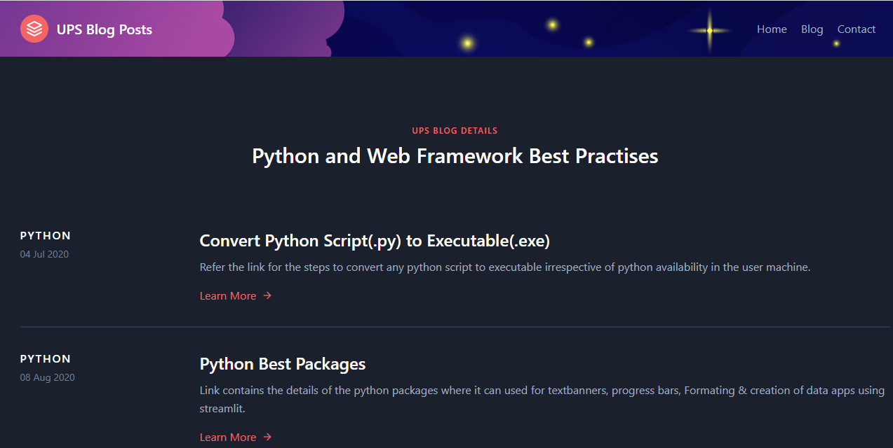

# Blog site
This repo contains the details of the python and web application blogs.

# How to host website using github pages
- Install the git bash tool from the link https://git-scm.com/downloads
- Create a folder in c drive and navigate to the folder in the git bash terminal cd c:\foldername
- git init
- git add .
- git commit -m "Initial development of website"
- git remote add origin reponame
- git push -u origin master

# Home Screen

> Note: Add the url link in About.
